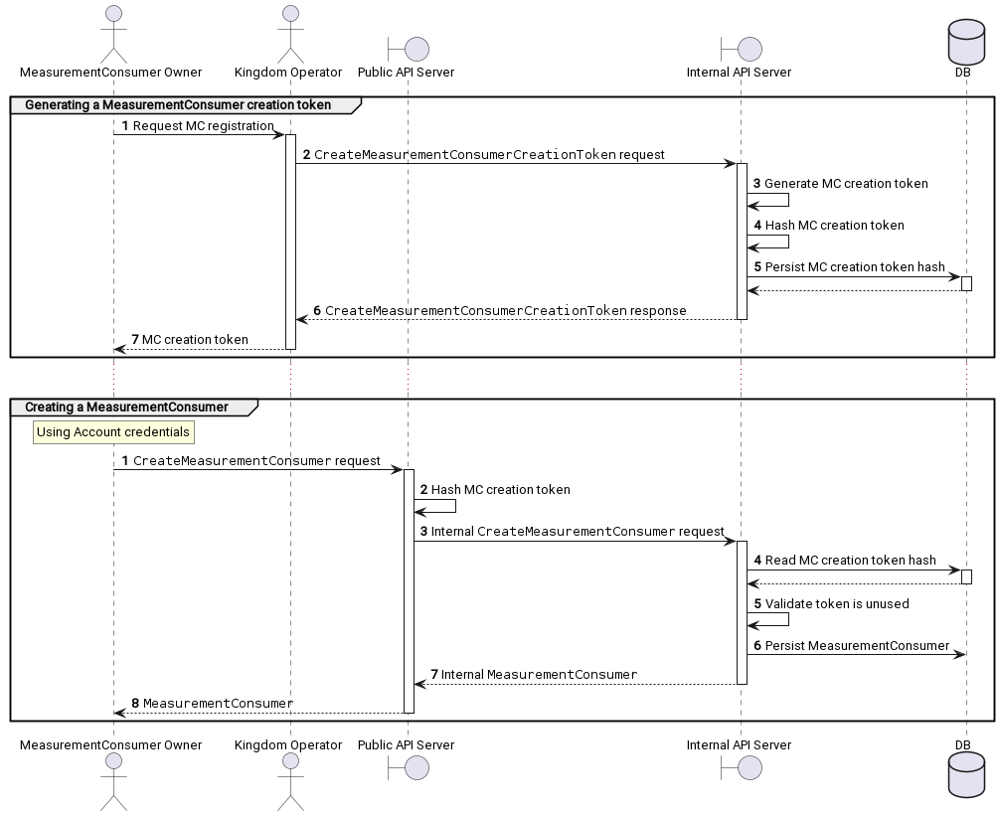

# MeasurementConsumer Creation Flow

## Generating a MeasurementConsumer creation token

1.  The MC owner requests registration of a new MC from the Kingdom operator.
1.  The Kingdom operator calls the Kingdom internal API to create a new
    MeasurementConsumer creation token.
1.  The internal API server generates a new MC creation token.
1.  " hashes the MC creation token.
1.  " persists the hash of the MC creation token in the database.
1.  " returns the MC creation token to the Kingdom operator.
1.  The Kingdom operator gives the MC owner the new MC creation token.

## Creating a MeasurementConsumer

This assumes the MC owner has already obtained Account credentials.

1.  The MC owner calls the public API to create a MeasurementConsumer, passing
    the MC creation token.
1.  The public API server hashes the MC creation token.
1.  " calls the internal API, passing the hash of the MC creation token.
1.  The internal API server reads the existing MC creation token hash from the DB.
1.  " verifies that the token is unused.
1.  " persists the new MeasurementConsumer in the DB, marking the token as used.
1.  " returns the internal MeasurementConsumer.
1.  " return the new MeasurementConsumer resource.
